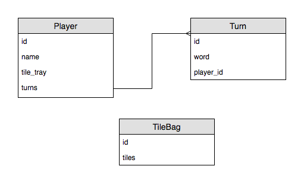

# Scrabble Rails Livecode
In this livecode for Ada Developers Academy we will be building a _Scrabble\*_ game using Ruby on Rails. The basis for this project is an earlier [standard Ruby project](https://github.com/AdaGold/scrabble) from the Ada curriculum.

\*This project does not fully implement the board game _Scrabble_.

## Database Schema
Our database consists of three models, `Turn`, `Player`, and `TileBag`. We will be creating each of these models in separate chapters while also implementing the custom functionality necessary for each of them. Here is an ERD with more details about the database schema:

## Outline
### Chapter 1 - Turn model
In this chapter we will create a `Turn` model that represents an individual play made by one of the players in the Scrabble game.

To begin with the model will have only a `word` attribute, and two methods which are from the original project's specification: `score` and `self.highest_scoring`.

[Panopto video recording](https://adaacademy.hosted.panopto.com/Panopto/Pages/Viewer.aspx?id=5b3ce984-8047-4c9e-8588-a8be012276ef)

### Chapter 2 - Player model
In this chapter we will create a `Player` model that represents one person that is participating in the Scrabble game.

Each player has a name, a tray of up to seven tiles, and a history of turns that they have played.

Additionally, players have the ability to play a word using the tiles in their tray. Each time a player plays a new word a `Turn` instance is created and added to their history of turns.

[Panopto video recording](https://adaacademy.hosted.panopto.com/Panopto/Pages/Viewer.aspx?id=ee125340-159c-499f-8181-a8c100397765)

### Chapter 3 - Player details page
In this chapter we will take our Rails project which currently consists only of model logic and turn it into a complete, if small, web application.

This means we will need to create a Controller for the actions related to our Player model, as well as a view template for the details page, and of course the proper route configuration.
